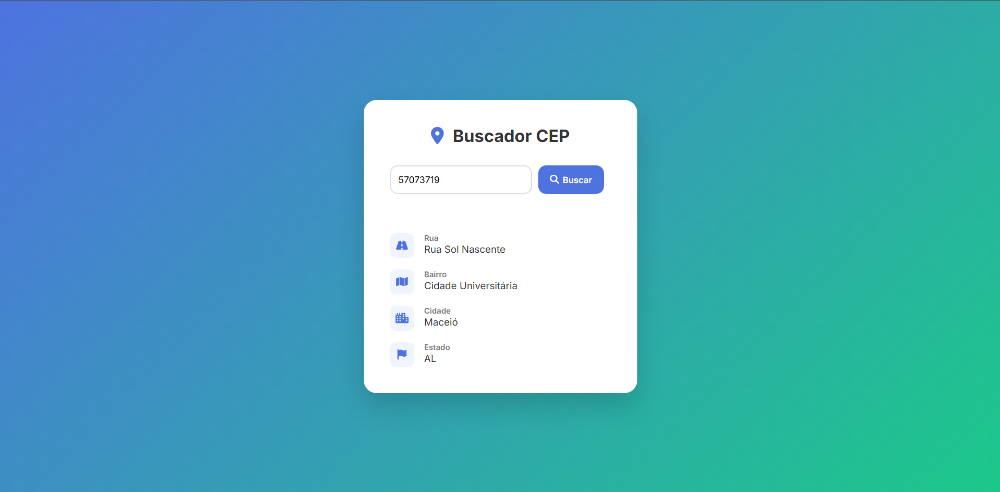

# 📍 Buscador de CEP

[](https://developer.mozilla.org/en-US/docs/Web/HTML) 
[](https://developer.mozilla.org/en-US/docs/Web/CSS) 
[](https://developer.mozilla.org/en-US/docs/Web/JavaScript) 

Aplicação web responsiva para consulta de endereços a partir do CEP, utilizando a API pública da ViaCEP.  

O projeto foi desenvolvido com foco em:

- Organização de código  
- Consumo de API com JavaScript assíncrono  
- Experiência do usuário  

---

## 🚀 Demonstração

Digite um CEP válido e pressione **Enter** ou clique em **Buscar** para obter:

- Rua  
- Bairro  
- Cidade  
- Estado  

### 🖼️ Interface

  
>
---

## 🛠️ Tecnologias utilizadas

- HTML5  
- CSS3 (Flexbox + Responsividade)  
- JavaScript (ES6+)  
- Fetch API  
- Font Awesome (ícones)  
- Google Fonts  

---

## ⚙️ Funcionalidades

✔ Consulta de CEP via API  
✔ Validação de entrada (8 dígitos)  
✔ Tratamento de erro para CEP inválido  
✔ Layout responsivo (mobile-first)  
---

## 📦 Como executar o projeto

1. Clone o repositório:

```bash
git clone https://github.com/seu-usuario/nome-do-repositorio.git
